# PLOT — Architecture

## 1. What PLOT is

A single-page React app for reimagining public space. You find a spot on a map, capture the
Street View looking at it, draw and place things on that photo, describe what you have made,
and post it.

It is **client-only**. There is no backend, no database, no accounts and no authentication.
Everything a visitor makes is written to their own browser's `localStorage`, behind a mock API
that has the shape of a real one. Two things leave the device: the map and Street View imagery
requested from Google, and — only after the visitor accepts the cookie banner — usage analytics
sent to PostHog.

Say that first, because nearly every other decision in this document follows from it. The
capture pipeline is elaborate *because* there is no server to render images. The preview export
is a low-quality JPEG *because* the whole record has to fit in a ~5 MB storage budget. The admin
routes are a build-time flag rather than a login *because* there is nobody to authenticate
against.

## 2. Stack

| Layer | What, and where it is pinned |
|---|---|
| Language | JavaScript, ESM (`"type": "module"`). **No TypeScript** — no `tsconfig`, no `jsconfig`. `@types/react` is a devDependency for editor hints only. `.jsx` for components, `.js` for logic. |
| UI | React 19 (`react`, `react-dom` ^19.2), `wouter` ^3.10 for routing, `react-konva` ^19.2 + `konva` ^10.3 for the canvas |
| Toolchain | **Vite+** (`vite-plus` ^0.2.5) — one `vp` binary covers dev, build, preview, lint, fmt and test. Bundler is rolldown, linter is oxlint. |
| Package manager | npm, with `package-lock.json`. No pnpm or yarn lockfile. |
| Styling | Plain CSS in `src/index.css` plus inline styles driven by the `THEME` object in `src/theme.js`. PostCSS runs `autoprefixer` and nothing else. |
| Imaging / CV | `@techstark/opencv-js` ^5.0 (13 MB UMD, never bundled — see §11), `html-to-image`, `use-image` |
| Analytics | `posthog-js`, consent-gated |
| Tests | Vitest via `vp test` (jsdom, globals on) with `@testing-library/react`, `user-event` and `jest-dom` |

**There is no CSS framework.** [README.md](README.md) and [PROJECT_SUMMARY.md](PROJECT_SUMMARY.md)
both claim Tailwind; they are wrong, and have been for a long time. There is no
`tailwind.config.js`, no `tailwindcss` dependency, and no utility classes in the source. If you
want a colour, read it off `THEME`.

There is also no Google Maps React wrapper. [MapContainer.jsx](src/components/MapContainer.jsx)
injects the Maps JS API script itself and calls `new window.google.maps.Map(...)` directly.

## 3. Layout

```
index.html                    Vite entry; <div id="root"> and a module script
vite.config.js                react plugin, the two OpenCV asset plugins, Konva
                              aliases, manualChunks, lint + test config
postcss.config.js             autoprefixer only
package.json                  every script delegates to `vp`
.env.example                  the four VITE_* vars, each with why it exists
.githooks/post-merge          warns after a merge that changed the lockfile
.github/CODEOWNERS            every PR needs review from the repo owner
public/_headers               Cache-Control rules (see §11)
scripts/check-deps.mjs        fails if node_modules drifts from package-lock.json
scripts/__tests__/            its test

src/
  main.jsx                    initAnalytics() then createRoot(<App/>)
  App.jsx                     routing, the whole flow's state, nav + footer chrome
  index.css                   font imports, resets, the .plot-* helper classes,
                              keyframes
  theme.js                    four THEME variants + the CAT category palette
  analytics.js                PostHog init and consent gating
  data.js                     seed content: sample imaginations, comments, ASSET_LIB
  legal.js                    operator details and external URLs for the legal pages
  assets/                     hero.png and the Vite/React starter SVGs — none are
                              currently imported anywhere
  components/                 22 files: the views, plus UI.jsx and Icon.jsx
                              primitives, ErrorBoundary, CookieBanner
    sandbox/                  4 files, one per sandbox experiment
    __tests__/                16 suites
  lib/                        14 modules of React-free logic (§7)
    __tests__/                12 suites
  sandbox/experiments.js      the register of experiments
  services/api.js             the mock API over localStorage
  test/setup.js               Vitest setup
  __tests__/analytics.test.js

docs/ref/                     a design reference mockup (HTML + JSX). Lint-ignored,
                              never imported, not shipped. Read it for intent, not
                              as code.
tools/streetview_lines/       standalone Python 3 + OpenCV CLI (extract_lines.py).
                              Deliberately not wired into the app — you run it by
                              hand. src/lib/detectLines.js is its browser port.
dist/                         build output (gitignored)
```

The repository root also carries [README.md](README.md), [QUICKSTART.md](QUICKSTART.md),
[PROJECT_SUMMARY.md](PROJECT_SUMMARY.md), [PROJECT_FILES.txt](PROJECT_FILES.txt),
[posthog-self-driving-report.md](posthog-self-driving-report.md) and
[european_planning_contacts.csv](european_planning_contacts.csv). Treat the first three with
suspicion: they predate most of the code and repeat claims this document contradicts.

One component is dead code worth knowing about before you go looking for it:
[MockMap.jsx](src/components/MockMap.jsx) is exported and never imported. `MapContainer` shows a
warning banner when there is no API key rather than falling back to it.

## 4. Boot and routing

[main.jsx](src/main.jsx) is fifteen lines and does three things in order: import `index.css`,
call `initAnalytics()`, then mount `<App/>` inside `<StrictMode>`. `initAnalytics()` runs before
the render because it decides whether PostHog exists at all for this page load, and the banner
`App` renders needs that already settled.

`App` is a `wouter` `<Switch>` inside an `<ErrorBoundary>`:

```
<ErrorBoundary>
  <Switch>
    /survey               → SurveyPage
    /admin/imaginations   → AdminGate → AdminImaginations
    /admin                → AdminGate → AdminDashboard
    /privacy              → MainApp initialView="privacy"
    /gdpr                 → MainApp initialView="gdpr"
    (no path)             → MainApp          ← catch-all: /, /sandbox, /sandbox/<id>,
  </Switch>                                    and anything unrecognised
</ErrorBoundary>
<CookieBanner/>
```

Every route's content is a `React.lazy` chunk behind a shared `LoadingFallback`. Twelve of them
are declared at the top of [App.jsx](src/App.jsx); nothing view-sized is in the entry bundle.

`CookieBanner` sits **outside** the boundary on purpose ([App.jsx:363-365](src/App.jsx)). If a
route crashes, the consent choice must still be reachable — a visitor who wants to withdraw
consent should not be blocked by an unrelated render error.

`AdminGate` reads `import.meta.env.VITE_ADMIN_ENABLED === 'true'` and otherwise renders an
"Access Restricted" panel. See §10 for what that is and is not.

## 5. State, and why the URL is nearly empty

`MainApp` holds the entire flow in `useState`:

| State | What it is |
|---|---|
| `currentView` | one of `welcome`, `map`, `street`, `describe`, `post`, `about`, `resources`, `sandbox`, `privacy`, `gdpr` |
| `capturedView` | the capture: `{ position, pov, fov, source, timestamp, screenshot }` |
| `canvasAssets` | assets placed on the photo |
| `lines` | lines drawn on or detected in the photo |
| `draft` | `{ title, cat, blurb }` from the Describe step |
| `preview` | the exported composite of the photo plus everything on it |
| `mapFocus` | where the map should reopen |

Views are props-driven, with callbacks upward. The draft lives in `MainApp` rather than in
`StreetScreen` specifically so that stepping forward to Describe and back again does not throw the
drawing away — the comment at [App.jsx:57-58](src/App.jsx) says so.

`mapFocus` exists for one moment: `handlePosted()` sets it to the position just posted, so the map
comes back centred on the new pin instead of a continent away.

**The Sandbox is the one view read off the location.** Every experiment has a link worth sharing,
so `inSandbox = location.startsWith('/sandbox')` overrides `currentView`, and the `show()` helper
keeps URL and state in step in both directions.

It is deliberately *not* its own `<Route>` with an `initialView`, the way `/privacy` is, and the
comment at [App.jsx:68-77](src/App.jsx) explains why: `Switch` reconciles two sibling `Route`s as
the same component instance, so `MainApp` is never remounted when the matched route changes, and an
`initialView` prop therefore only ever applies on first mount. That works for a URL you can only
*arrive* at, and silently does nothing for one you can navigate to from inside the app. Reproduce
that reasoning before you "fix" it.

## 6. The create flow

`FLOW_VIEWS = ['street', 'describe', 'post']` render full-bleed, without the nav bar and footer
the other views sit inside. [FlowLayout.jsx](src/components/FlowLayout.jsx) supplies the step bar
and the back/actions chrome.

```dot
digraph capture {
  rankdir=LR;
  node [shape=box, fontname="Helvetica", fontsize=10];

  map     [label="MapContainer\nMaps JS API + StreetViewPanorama"];
  read    [label="readPanoramaView()\nposition, heading, pitch, zoom → fov"];
  tiles   [label="streetViewBackgroundTiles()\n2×2 narrow-FOV requests"];
  gain    [label="tilingGain ≥ 1.25?", shape=diamond];
  stitch  [label="stitchPanoTiles()\ninverse-mapped homography"];
  wide    [label="one wide 640×448 request"];
  mapfall [label="staticMapUrl()\ntop-down tile", style=dashed];
  street  [label="StreetScreen → ImaginationCanvas\nKonva stage 1000×700"];
  export  [label="stage.toDataURL()\nJPEG q0.75, pixelRatio 1"];
  post    [label="DescribePage → PostPage\nsaveImagination()"];

  map -> read -> tiles -> gain;
  gain -> stitch [label="yes"];
  gain -> wide [label="no"];
  stitch -> street [label="≥98% covered"];
  stitch -> wide [label="holes", style=dashed];
  wide -> street;
  wide -> mapfall [label="404: no coverage", style=dashed];
  mapfall -> street [style=dashed];
  street -> export -> post;
}
```



**`MapContainer`.** Injects `maps/api/js?libraries=places`, creates the map, takes the panorama
from `googleMap.getStreetView()` and keeps it in a *ref* — the capture handler reads
`getVisible()` / `getPosition()` / `getPov()` live at click time, so there is nothing to re-render
on as the user pans. Saved imaginations are loaded once per mount via `fetchImaginations()` and
pinned with `google.maps.Marker`, coloured from `CAT` so the map reads the way the category tags
do. Clicking a pin opens an [ImaginationPreview](src/components/ImaginationPreview.jsx) card;
Escape closes it. The default location is STPLN, Malmö (55.6054, 12.9854). Places Autocomplete is
wired to the floating search box.

**Capture is server-rendered, and that is the interesting part.** The browser *cannot* screenshot
a Street View panorama: Google renders it into a WebGL canvas over cross-origin tiles, and
`html-to-image` — which rasterizes a DOM clone through an SVG `<foreignObject>` — carries neither
across, yielding a black frame with Google's DOM controls on top. So Google's servers are asked
for the image instead ([staticMaps.js:1-8](src/lib/staticMaps.js)).

That trades one problem for another. Both Static endpoints cap output at **640 px per side**, and
the Street View endpoint has no `scale` parameter to work around it. Worse, an oversized request is
not clamped to the requested aspect ratio — it comes back square — so callers must clamp before
sending or the background arrives distorted.

The way out is that the cap is per *request*, not per scene:

- `streetViewBackgroundTiles()` plans a 2×2 grid of narrow-FOV **square** tiles covering the same
  view. Square, because narrowing the FOV shrinks the *vertical* field of view too, and a tile too
  narrow misses the road entirely.
- `tilingGain()` decides whether the extra requests earn their keep. The gain shrinks as the
  panorama zooms in — a wide shot already spending its 640 px on a narrow arc is no worse than a
  tile of it — so `MIN_TILING_GAIN = 1.25` in `MapContainer` bows out somewhere around fov 30, and
  `MAX_TILING_SCALE = 2` caps the output regardless, since past the 1000×700 stage the extra
  pixels buy detail nothing displays.
- `stitchPanoTiles()` recombines them. Tiles and the wide frame are rectilinear views from one
  optical centre differing only in orientation, which makes tile → wide an exact **homography**.
  Canvas 2D applies affine transforms only, and an affine approximation misaligns the seams — so
  the composite is built by **inverse mapping**: every output pixel asks `unprojectWidePoint()`
  which tile sees its direction and samples that tile bilinearly. Where tiles overlap, a pixel
  takes the one whose centre it sits nearest — a hard boundary, not a blend, because blending two
  views of the same scene softens exactly the detail the extra requests were paid for. Below 98%
  coverage (`MIN_COVERAGE`) the composite is rejected and the caller falls back.

Failure paths, all deliberate:

- A stitch failure logs a warning and returns `null` → single wide request.
- A **404** means no Street View coverage here, which is why `streetViewStaticUrl()` sets
  `return_error_code=true`; without it Google answers with a grey "no image" tile and HTTP 200 that
  would silently become the canvas background. The 404 is caught and answered with a top-down
  `staticMapUrl()` tile instead ([MapContainer.jsx:340-361](src/components/MapContainer.jsx)).
- Capturing the *map* rather than a panorama is the one place `html-to-image` is still used — an
  ordinary DOM screenshot of a DOM map works fine.

Every image is inlined as a `data:` URL by `fetchAsDataUrl()`. That keeps the captured payload
self-contained *and* leaves the Konva stage untainted, which is what makes the later
`stage.toDataURL()` export legal at all.

**`StreetScreen` → `ImaginationCanvas`.** A Konva `Stage` of 1000×700 with three `Layer`s:
background image, lines, assets. Assets are draggable `Circle`s with a label and a four-corner
`Transformer` (rotation disabled). Lines are drawn by dragging in `draw` mode and classified by
`LINE_CLASSES`; `hitStrokeWidth` widens the invisible hit area because a 2 px stroke is hard to hit
precisely. Delete/Backspace removes the selection, Escape abandons an in-progress drag and returns
to `select`. The line layer is sorted by `sortByRenderOrder` so vegetation outlines stay above road
lines regardless of the order they were drawn in.

Auto-detect is a separate, deliberately staged path
([ImaginationCanvas.jsx:167-239](src/components/ImaginationCanvas.jsx)): it dynamically imports
`detectLines`, then loads OpenCV in **two labelled phases** — "Loading detector (~4 MB)" and
"Detecting" — because the first call downloads and instantiates several megabytes of WASM and reads
as a hang without its own label. When the capture came from Street View and a key is available, it
re-fetches the scene as a *row* of tiles (`streetViewTileUrls`, road band only) for roughly 2×
angular resolution. Detected lines are folded into the same `lines` array as hand-drawn ones and
are indistinguishable from them afterwards — selectable, deletable, exported the same way.

**Leaving step 1 exports the composite.** `stage.toDataURL()` with `mimeType: 'image/jpeg'`,
`quality: 0.75`, `pixelRatio: 1`, and the reasoning is at
[StreetScreen.jsx:26-50](src/components/StreetScreen.jsx): `saveImagination` rewrites the whole
imaginations array into localStorage's ~5 MB budget, and a full-size PNG of a 1000×700 stage runs
1–2 MB against a couple of hundred KB for the same frame as JPEG. `pixelRatio` stays at 1 because
the background is a stitched capture of roughly that resolution already — going higher would only
interpolate the photo while spending budget the overlays do not need. PNG is used when there is
*no* photo, since JPEG has no alpha and a transparent stage would flatten to solid black.

**`DescribePage` → `PostPage` → `saveImagination()`.** Then `handlePosted()` clears the draft, sets
`mapFocus`, and reopens the map on the new pin.

## 7. `src/lib/` — the logic layer

React-free, unit-tested directly, and where new algorithmic work belongs. Fourteen modules.

**Capture and computer vision**

| Module | What it owns |
|---|---|
| [panoGeometry.js](src/lib/panoGeometry.js) | The pinhole arithmetic behind the 640 px cap: `focalFor`, `verticalFov`, `projectTilePoint` / `unprojectWidePoint` (exact inverses), `planTiles` (a row over the road band), `planGridTiles` (a grid over the whole frame), `tilingGain`, `roadBandCentreDeg`, and a Liang–Barsky `clipSegmentToRect`. The table in its header — 7.1 px/deg for a wide shot against 12.8 px/deg for a tile — is the whole argument for tiling. |
| [panoStitch.js](src/lib/panoStitch.js) | `composeTiles` (pure: no canvas, no DOM, hence testable in jsdom) and `stitchPanoTiles` above it, which is where the `Image` decode and canvas live. A 10 s decode deadline turns an `` that neither loads nor errors into an ordinary fallback rather than a capture button stuck forever on "Capturing view". |
| [staticMaps.js](src/lib/staticMaps.js) | URL builders for both Static endpoints, `fovFromPanoramaZoom` (panorama zoom is logarithmic; zoom 1 is a 90° field of view), `fetchAsDataUrl`, and `StaticImageError` carrying the HTTP status so callers can tell "no coverage" (404) from "bad key" (403). Records that `maptype=satellite`/`hybrid` are refused with 403 under Google's EEA terms, which is why `roadmap` is the fallback. |
| [detectLines.js](src/lib/detectLines.js) | Browser port of `tools/streetview_lines/extract_lines.py`: bilateral → CLAHE → Canny → `HoughLinesP`, plus HSV masks for paint and vegetation. Three deliberate differences from the Python original are listed in its header: **(1)** canvas pixels arrive RGBA, not BGR, so the conversion codes are `RGBA2GRAY`/`RGB2HSV` — the BGR codes would swap red and blue and invert every hue mask; **(2)** coordinates are scaled into Konva stage space before returning, because the stage is larger than the captured image and stretches it to fit; **(3)** the marking pass has an adaptive guard the Python tool lacks. |
| [mergeLines.js](src/lib/mergeLines.js) | `HoughLinesP` reports one physical edge as several overlapping segments — on a real Malmö capture, 27 structural segments were only 13 distinct edges, and a tram rail crossing the whole frame came back as ~136 px pieces on a 1000 px stage. This collapses them with a weighted principal-axis fit, **dependency-free** rather than `cv.fitLine`, so it runs without OpenCV loaded and works on hand-drawn lines too. Merges only within a class, so a road edge never absorbs a near-collinear kerb. |
| [lineClasses.js](src/lib/lineClasses.js) | The five classes — road edge, kerb/crossing, pole, lane marking, vegetation — mirroring the constants in `extract_lines.py`, with the Python-side names written down for traceability. `LINE_CLASS_ORDER` is the Python renderer's z-order (vegetation last, so canopies sit above lines passing behind them). `__tests__/lineClasses.test.js` asserts the colours and strokes have not drifted from the Python side. |
| [opencvLoader.js](src/lib/opencvLoader.js) | Injects the version-keyed static asset as a `<script>` and memoises the promise. The package is an Emscripten MODULARIZE build, so `globalThis.cv` is a *thenable* — awaiting it is required, and the older `cv.onRuntimeInitialized` callback is not set on this build, so waiting for it hangs forever. A failure clears the memo and removes the tag so Auto-detect can be retried after a transient fault. `setOpenCv()` overrides it for tests and Node scripts. |
| [konva-core-slim.js](src/lib/konva-core-slim.js) | Slim replacement for Konva's core barrel, importing only what the canvas uses and dropping Animation, Tween, Easings and FastLayer. Aliased in by [vite.config.js](vite.config.js) (§11). |

The marking guard deserves its own note, because it is the clearest example of this codebase's
habit of measuring before choosing a constant. Paint is "low saturation, high value" — and so is
sunlit concrete. On a Malmö capture with no painted markings at all, the unguarded pass produced
217 segments smeared across the road surface. The header of `detectLines.js` records the
measurements:

```
vMin 175 -> 20.6% coverage -> 217 segments   (pavement)
vMin 195 ->  5.9%          ->  66 segments   (pavement)
vMin 215 ->  1.0%          ->   9 segments
vMin 225 ->  0.4%          ->   0 segments
```

Hence `MARKING_MAX_COVERAGE = 0.02`: above 2% the mask is tracking pavement, not paint. The pass
escalates the brightness floor until coverage falls under the ceiling and then gives up rather than
blanketing the road. Erring strict is deliberate — a missed marking can be drawn by hand, which is
the other half of the feature, and 217 false lines cannot be cleaned up by hand.

**Sandbox logic**

| Module | What it owns |
|---|---|
| [gridPath.js](src/lib/gridPath.js) | One Dijkstra over a rectangular cell grid, with its own binary min-heap. Shared by two experiments because "how far is the nearest amenity" and "how long is the paved route" are the same question. Returns **cell steps**, not metres; callers multiply by their own cell size, which is the only thing that differs between them. |
| [reachGrid.js](src/lib/reachGrid.js) | 15-Minute Reach: a 16×16 grid of 100 m cells with a railway across row 8 crossable only at two bridges, an 80 m/min walk and a 15-minute budget. The railway is the whole reason the experiment is worth building — coverage measured as the crow flies looks fine, and coverage measured on foot does not. |
| [desireLines.js](src/lib/desireLines.js) | Desire Lines: a 100×60 m plaza paved as a perimeter ring and a central cross, with the destinations people walk between in the corners, so the paving asks for a right angle and the walk wants a diagonal. `offPavedShare`, `suggestPaving`, and a seeded `neighbourJourneys` so the crowd is reproducible. |
| [streetSection.js](src/lib/streetSection.js) | Street Section Mixer: the arithmetic of a fixed-width cross-section. Eight segment types with min/max/default widths, throughput per metre of width, and a canopy multiplier. Every preset fills exactly 20 m, so switching between them is a pure reallocation rather than a change of street. The figures are calibrated to make the trade-offs feel right, not to size a real scheme, and the header says so. |
| [budgetBallot.js](src/lib/budgetBallot.js) | Budget Ballot: €250,000, nine interventions, four outcomes and five affected groups whose effects are allowed to point in opposite directions — a scheme that scores well for children can score badly for the shopkeepers whose support it needs. |

**Everything else**

| Module | What it owns |
|---|---|
| [clipboard.js](src/lib/clipboard.js) | `copyText()` returning whether the text *actually* reached the clipboard. The API is missing in older browsers, absent outside a secure context, and rejects outright if permission is refused — and the honest fallback is to show the text and let the visitor copy it, which callers can only do if they are told which happened. |

## 8. Persistence

[services/api.js](src/services/api.js) is the only module that touches `localStorage`. Every read
and write in the app goes through it, and every function is `async` with a `simulateDelay()` so
that callers already handle latency. That is the point: swapping in a real backend should not touch
a single component.

Current:

```javascript
export const saveImagination = async (data) => {
  await simulateDelay();
  const imaginations = JSON.parse(localStorage.getItem('placemaking_imaginations'));
  imaginations.push(data);
  localStorage.setItem('placemaking_imaginations', JSON.stringify(imaginations));
  return data;
};
```

With a server:

```javascript
export const saveImagination = async (data) => {
  const response = await fetch('/api/imaginations', {
    method: 'POST',
    headers: { 'Content-Type': 'application/json' },
    body: JSON.stringify(data)
  });
  return response.json();
};
```

No component changes required — the `async` interface is identical.

Four keys, still on their original `placemaking_` prefix:

| Key | Holds |
|---|---|
| `placemaking_imaginations` | every posted imagination, including its `preview` data URL |
| `placemaking_assets` | the seeded asset library |
| `placemaking_upvotes` | declared, currently unused |
| `placemaking_comments` | declared, currently unused |

`initializeDefaultAssets()` runs on module load and seeds six placeholder-image assets if the key
is absent. **Note the duplication:** the canvas palette does not read that library — `StreetScreen`
passes `ASSET_LIB` from [data.js](src/data.js) into `ImaginationCanvas`. Two asset lists exist and
only one of them is ever on screen.

`exportAllData()` and `eraseAllData()` back the portability and erasure requests on the GDPR page.
Erasure clears the four keys above and nothing else, so the seeded asset library returns on the
next load (it is seed data, not user data) — and, importantly, the consent record survives, because
it deliberately lives outside that map (§10).

There is no schema versioning and no migration step. A change to the stored shape will meet
whatever an existing browser already holds, so either keep the shape backward-compatible or add a
version gate before changing it.

## 9. Sandbox

[sandbox/experiments.js](src/sandbox/experiments.js) is a **register**, not a switch. One object
here plus one component under `components/sandbox/` adds an experiment, and the gallery, the
routing and the copyable link all read from that list. Each entry carries an `id`, a name, a
tagline, a blurb, a `hint` ("the one thing worth trying first"), a colour, an icon and the
component itself.

`findExperiment(id)` returns `null` rather than throwing, so an unknown `/sandbox/<id>` is a 404
page and not a crash. [SandboxPage.jsx](src/components/SandboxPage.jsx) owns the `/sandbox` portion
of the URL itself (see §5), and [SandboxLayout.jsx](src/components/SandboxLayout.jsx) supplies the
shared chrome plus the small readout primitives the experiments build their panels from —
including the copy-link button, which uses `clipboard.js` and falls back to showing the URL when
the browser refuses.

Four experiments today: Street Section Mixer, Desire Lines, 15-Minute Reach and Budget Ballot. Each
is a self-contained toy in the spirit of Chrome Music Lab — no sign-in, nothing saved, and
something moving within a second of arriving.

## 10. Analytics, consent, admin

[analytics.js](src/analytics.js) is the only module that touches PostHog's consent API. Everywhere
else calls `posthog.capture()`, which is a no-op until PostHog has been initialised.

- `isAnalyticsConfigured()` requires **both** `VITE_POSTHOG_KEY` and `VITE_POSTHOG_HOST`. With
  either missing, PostHog is never initialised, no banner is shown, and every `capture()` call is
  inert.
- `initAnalytics()` starts PostHog only for a visitor who *already* accepted on a previous visit.
  Until acceptance nothing is loaded: no request leaves the browser, no cookie is written, no
  session is recorded. This asks before turning anything on rather than notifying after the fact.
- `startPostHog()` inits with `opt_out_capturing_by_default` and `opt_out_persistence_by_default`
  both `true`, *even here*, so that the explicit `opt_in_capturing()` immediately after is the
  single switch that turns capture on. That also clears an opt-out flag left in storage by an
  earlier withdrawal, which would otherwise silently outlive a re-accept. The automatic init-time
  pageview is dropped while opted out, so `$pageview` is captured by hand or the session would have
  no entry page.
- The default `$opt_in` event is the audit trail for the consent, so it is captured when consent is
  *given* and suppressed on the page loads that follow.
- `CONSENT_KEY = 'plot_analytics_consent'` lives **outside** the `STORAGE_KEYS` map in `api.js`, so
  "erase my data" does not wipe the record of a choice the visitor has to be able to rely on. The
  GDPR page changes it explicitly instead.
- Storage being blocked (private mode, cookies disabled) is treated as undecided: the banner shows
  again and analytics stay off.

[CookieBanner.jsx](src/components/CookieBanner.jsx) publishes its own height as the CSS variable
`--plot-consent-inset`, which `MapContainer` reads
(`bottom: calc(24px + var(--plot-consent-inset, 0px))`) so the floating search and capture controls
stay reachable while the banner is up.

Twelve product events are captured across the app, from `explore_started` through `view_captured`,
`canvas_asset_added`, `canvas_lines_auto_detected` and `imagination_posted` to `data_erased`,
alongside the hand-fired `$pageview` and the `$opt_in` consent record above.

**Admin is gated, not secured.** `VITE_ADMIN_ENABLED` is a build-time flag over two URLs
(`/admin`, `/admin/imaginations`) that nothing in the UI links to. `AdminGate` renders a polite
refusal when the flag is off. That is obscurity plus a build switch — it is not authentication,
[.env.example](.env.example) says so outright, and it must not be relied on as though it were.

## 11. Build, bundle discipline, deploy

[vite.config.js](vite.config.js) is short and every decision in it is commented. The comments are
the specification; do not undo any of this without reading them.

**OpenCV is not bundled.** It is a 13 MB UMD build with its WASM embedded. Running it through the
bundler inflates it by a further ~2.2 MB of pure overhead and drags in a "crypto externalized"
warning, so it is emitted as a plain static asset at `assets/opencv-<version>.js`. The name is
keyed on the package version rather than a chunk hash so it lands under the immutable
`Cache-Control` rule in `public/_headers` and **stays cached across app deploys** — a bundler hash
churns on every rebuild whether or not OpenCV changed.

It takes **two plugins**, not one, because `apply` gates every hook on the plugin object: the
build-time `emitFile()` and the dev/test-time serve middleware need opposite `apply` values, and
`emitFile()` warns ("context method not supported") if it fires inside `vp dev`/`vp test`'s
serve-mode plugin container. The path reaches the app as the `__OPENCV_ASSET_PATH__` define, which
`opencvLoader.js` joins to `import.meta.env.BASE_URL`.

**Two Konva aliases.**

- `react-konva` → `react-konva/lib/ReactKonvaCore`, matched by the **regex** `/^react-konva$/`.
  Exact-match only, because a plain string key would also match — and mangle — deep imports like
  `react-konva/lib/ReactKonvaCore` itself.
- `konva/lib/Core.js` → `src/lib/konva-core-slim.js`, the slim barrel from §7. Shapes are then
  imported one by one at the top of `ImaginationCanvas.jsx` (`konva/lib/shapes/Circle`, `Line`,
  `Text`, `Transformer`, `Image`), which is what keeps the unused ones out.

**`manualChunks` is a function, not an object map.** rolldown — Vite+'s bundler — does not support
the object form rollup accepts. It splits `react-reconciler` and `konva` into `vendor-konva`, and
`react-dom` into `vendor-react`.

**Cache headers.** [public/_headers](public/_headers) pairs with the version-keyed asset:
`/assets/*` is `max-age=31536000, immutable`, while `/` and `/*.html` are
`max-age=0, must-revalidate` so a deploy is picked up immediately.

**Dependency drift is a build error.** [scripts/check-deps.mjs](scripts/check-deps.mjs) walks
`package-lock.json` and compares every locked version against the `package.json` actually installed
under `node_modules`, then cross-checks npm's hidden lockfile for packages present on disk that the
real lockfile no longer wants. Platform-specific optional deps (`fsevents`, the oxlint and rolldown
native bindings) are expected to be absent and are skipped. `npm audit` cannot catch this class of
problem, because it resolves the tree from the lockfile rather than from disk. The check runs as
`prebuild`, so `npm run build` fails loudly rather than building against a tree nobody described.
[.githooks/post-merge](.githooks/post-merge) runs the same check after a merge, with `|| true` so it
warns rather than blocks.

**Environment.** Four variables, all documented in [.env.example](.env.example):

| Variable | Notes |
|---|---|
| `VITE_GOOGLE_MAPS_API_KEY` | needs **three** APIs enabled: Maps JavaScript, Street View Static, Maps Static. A key with only Maps JavaScript loads the map fine and makes every capture fail with 403. |
| `VITE_POSTHOG_KEY` | required together with the host, or analytics never initialise |
| `VITE_POSTHOG_HOST` | regional ingestion endpoint, e.g. `https://eu.i.posthog.com` |
| `VITE_ADMIN_ENABLED` | `'true'` opens the two admin URLs; see §10 |

**Deploy** is a static bundle: `npm run build`, then serve `dist/`. `public/_headers` is in
Netlify's format; on another host the equivalent rules have to be reproduced, or the
immutable-caching argument above stops holding.

## 12. Testing

**Unit tests only, and there are a lot of them.** 30 Vitest suites run through `vp test`, which is
configured inside [vite.config.js](vite.config.js) rather than a separate file: `globals: true`,
`environment: 'jsdom'`, `css: true`, and `setupFiles: './src/test/setup.js'`.

- 16 component suites in `src/components/__tests__/` — `App`, `AdminGate`, `AdminDashboard`,
  `AdminImaginations`, `CookieBanner`, `DescribePage`, `ErrorBoundary`, `ImaginationCanvas`,
  `ImaginationPreview`, `LegalPages`, `MapContainer`, `PostPage`, `SandboxPage`, `SandboxTools`,
  `StreetScreen`, `SurveyPage`
- 12 logic suites in `src/lib/__tests__/`, one per non-trivial module
- [src/\_\_tests\_\_/analytics.test.js](src/__tests__/analytics.test.js) and
  [scripts/\_\_tests\_\_/check-deps.test.js](scripts/__tests__/check-deps.test.js)

[src/test/setup.js](src/test/setup.js) does one thing beyond loading `jest-dom`, and it is worth
knowing about: it stubs `VITE_POSTHOG_KEY` and `VITE_POSTHOG_HOST` to empty strings before every
test. A developer's real `.env` holds real PostHog credentials, and Vite loads `.env` in test mode
too — which would mount the cookie banner inside every test that renders `<App/>`, whose "Privacy
Policy" link would then collide with the footer's. Tests that are *about* the banner stub the values
back on themselves.

Note also that it imports `beforeEach` / `afterEach` / `vi` from `vite-plus/test`, not from
`vitest`.

**What the unit tests cannot cover.** They run in jsdom, so:

- no WebGL and no real Konva rendering — canvas assertions are about the React tree Konva is asked
  to build, not about pixels
- no real Google Maps: `MapContainer`'s tests drive a stub
- no real OpenCV in the component path. `composeTiles` in `panoStitch.js` is pure precisely so the
  compositing maths *can* be tested, while the `Image`/canvas half above it cannot be
- no confirmation that the lazy route chunks, the emitted OpenCV asset and the `_headers` rules
  assemble the way a visitor actually receives them

**There is no end-to-end suite and no CI workflow.** No Playwright, no `e2e/` directory, no
`.github/workflows/` — `.github/` contains only [CODEOWNERS](.github/CODEOWNERS), which requires
owner review on every pull request. If you came looking for either because another document or an
unmerged branch mentioned it, it is not on `Development`. The list above is the argument for adding
one; the lazy-chunk and 13 MB-asset shape of the build is the reason it would have to run against
`vp preview` output rather than `vp dev`.

## 13. Commands

Always go through the npm scripts, so the **local** `vp` is used. A globally installed `vp` may be
an older version and behave differently.

```bash
npm ci               # install exactly what the lockfile says
npm run dev          # vp dev
npm run lint         # vp lint (oxlint; ignores dist/** and docs/ref/**)
npm run build        # vp build — prebuild runs deps:check first
npm run preview      # serve the production build
npm run test         # vp test — WATCH mode
npm run test:run     # vp test run — one-shot; use this in automation
npm run deps:check   # node scripts/check-deps.mjs
```

`npm run lint` covers JavaScript only, so it says nothing about this file.

The Python line extractor is separate, and run by hand:

```bash
cd tools/streetview_lines
python3 -m venv .venv && source .venv/bin/activate
pip install -r requirements.txt
python3 extract_lines.py path/to/screenshot.png --stats
```
